# Front-end Learning Journey

Hello there 👋. This repository is an overview of my front-end learning journey.

<br>

## Front-End Projects from Roadmap.sh:
<br>

1. ### Project01-CV.html
  #### Key Concepts Demonstrated:
  * Semantic HTML
  * SEO Meta Tags
  * Open Graph (OG) Tags
  * Favicon
    
<br>

### To Complete beginners who are not familiar with the above concepts. Below is a presentation that covers  all Four Concepts.

<br>

<table align="center">
  <tr>
    <td>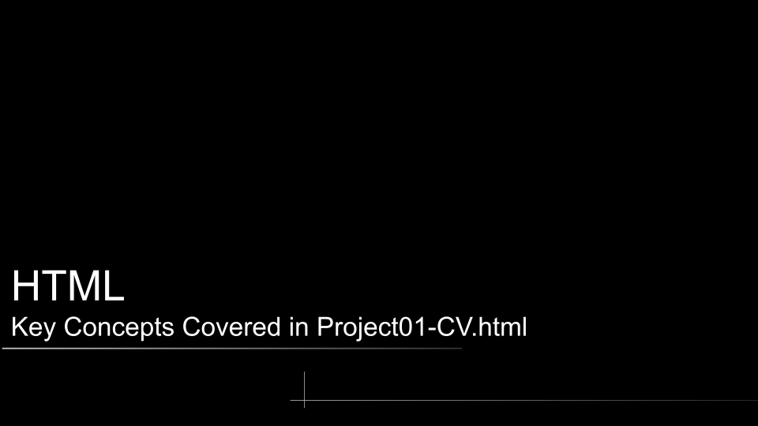</td>
    <td></td>
    <td>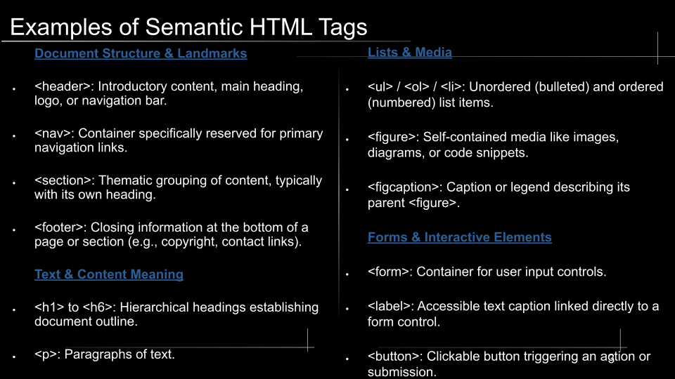</td>
    <td>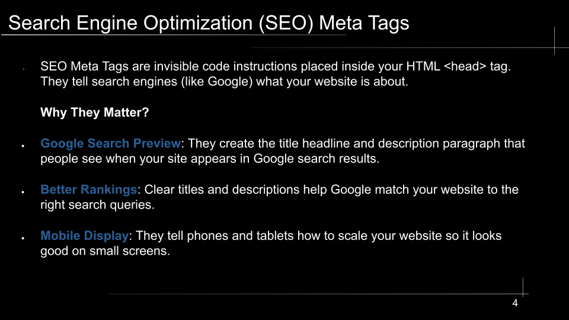</td>
    <td>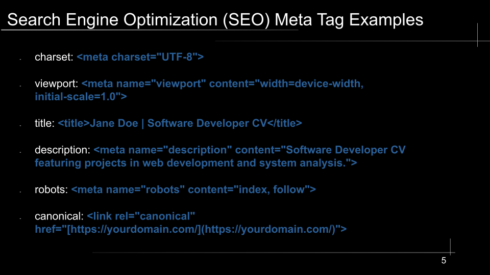</td>
    <td>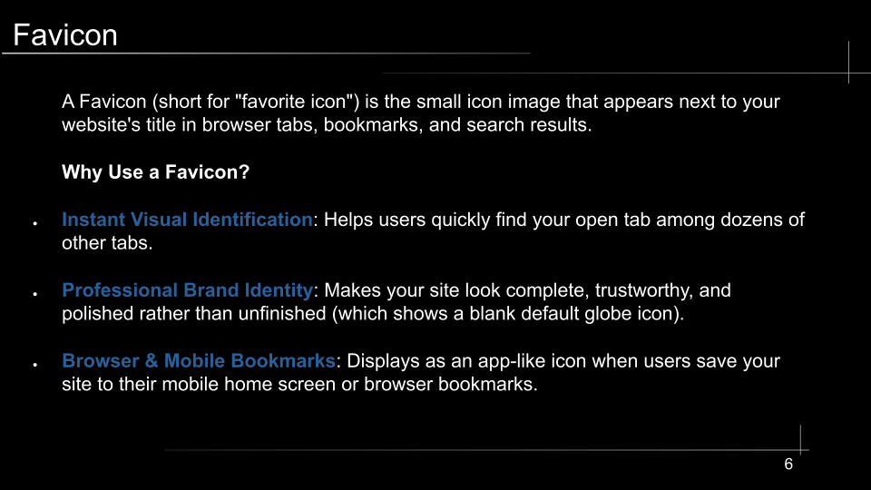</td>
    <td>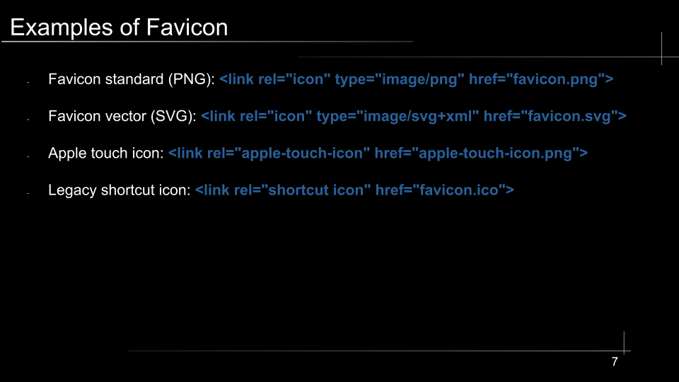</td>
    <td>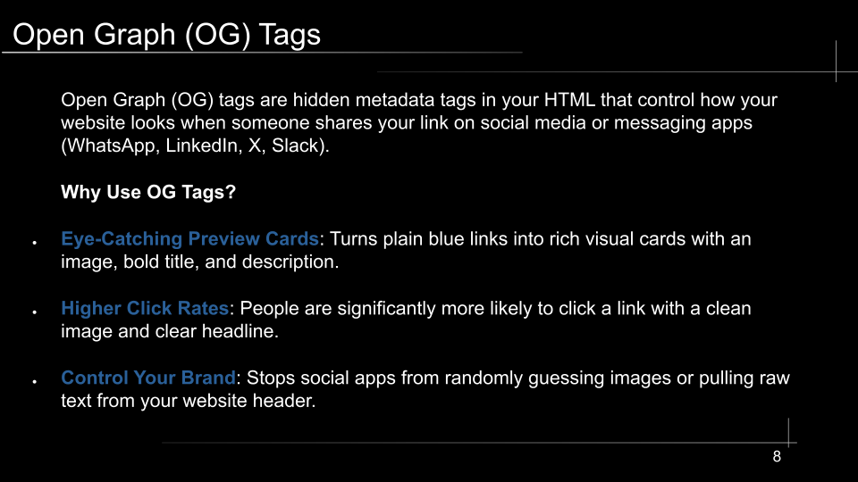</td>
    <td>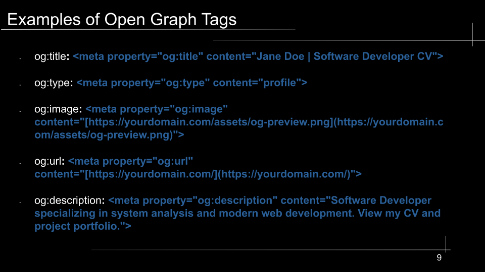</td>
    <td>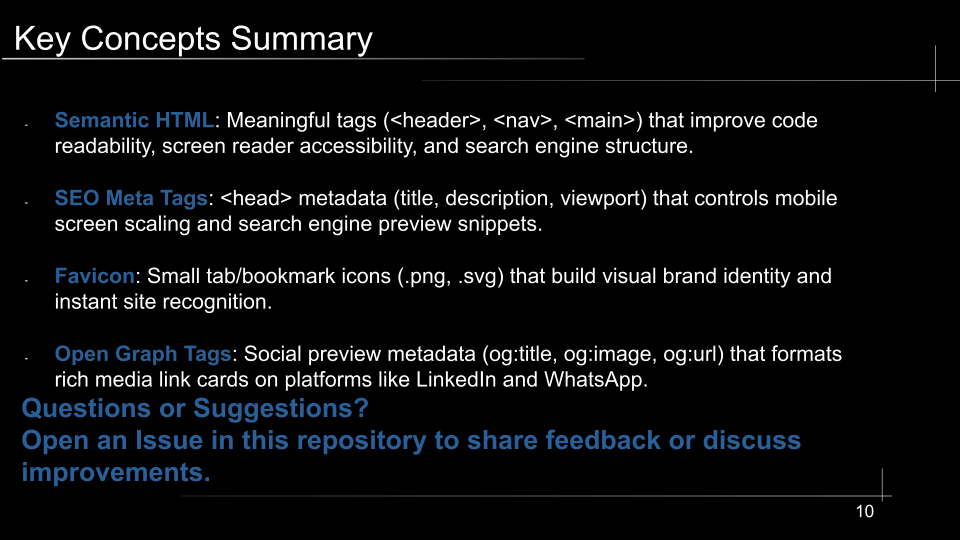</td>
  </tr>
</table>
<br>
<br>

## Final project:
<p align="center">
  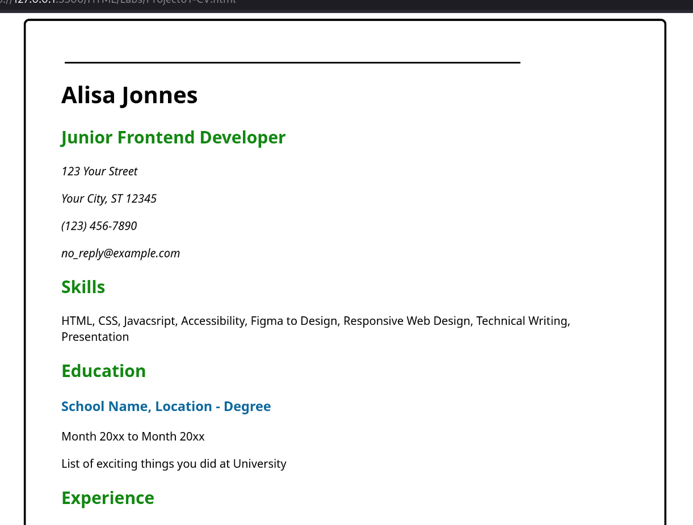
</p>

<br>


2. ### Project02-BasicHtmlWebsite.html
  #### Instructions:
  * In this project, you are required to create a simple HTML-only website with multiple pages. The website should have the following pages:
      * Homepage
      * Projects
      * Articles
      * Contact
   
<br>

## Final project:
<p align="center">
  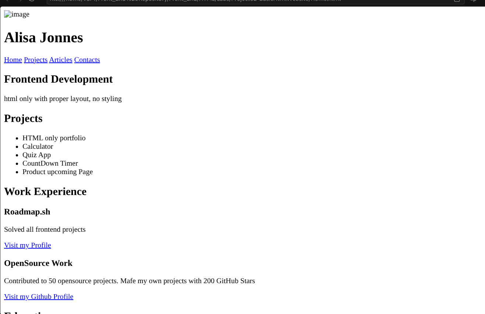
</p>

<br>

3. ### Project03-PersonalPortfolio.html
  #### Submission Requirements:
* A fully styled, responsive website with the same structure as the previous project.
* Consistent use of a chosen color scheme and typography.
* Proper use of CSS techniques like Flexbox, media queries, and the box model.
* A responsive navigation bar and well-styled contact form.

<br>

### Projects URLs: 
* <a href="https://roadmap.sh/projects/single-page-cv">Single-page CV </a>
* <a href="https://roadmap.sh/projects/basic-html-website">Basic HTML Website</a>
* <a href="https://roadmap.sh/projects/portfolio-website">Personal Portfolio</a>

<br>
<br>
  

## How to Run HTML projects:
No installation or build tools are required. You only need a web browser.
<br>
<br>

### Quick Start
* **Clone the repository:**
   ```bash
   git clone [https://github.com/V3r4-4/Front_End.git](https://github.com/V3r4-4/Front_End.git)
* Navigate into the project folder
* Open the page:
  * Double-click project01-CV.html to open it directly in your default web browser.
  * Or, if using VS Code, right-click project01-CV.html and select Open with Live Server.

<br>
<br>

### Disclaimer!!

Work in progress.


